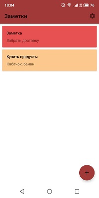
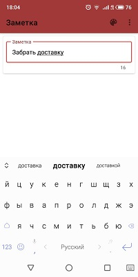
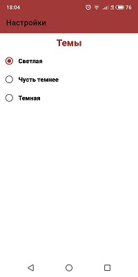

Приложение для заметок Free Notes.

В проекте использоавнны:
архитектурный паттерн MVVM,
библиотека room для локального ранения заметок,
библиотека hilt для dependency injection,
android Jetpack's Navigation component для навигации,
coroutines для многопоточности.
